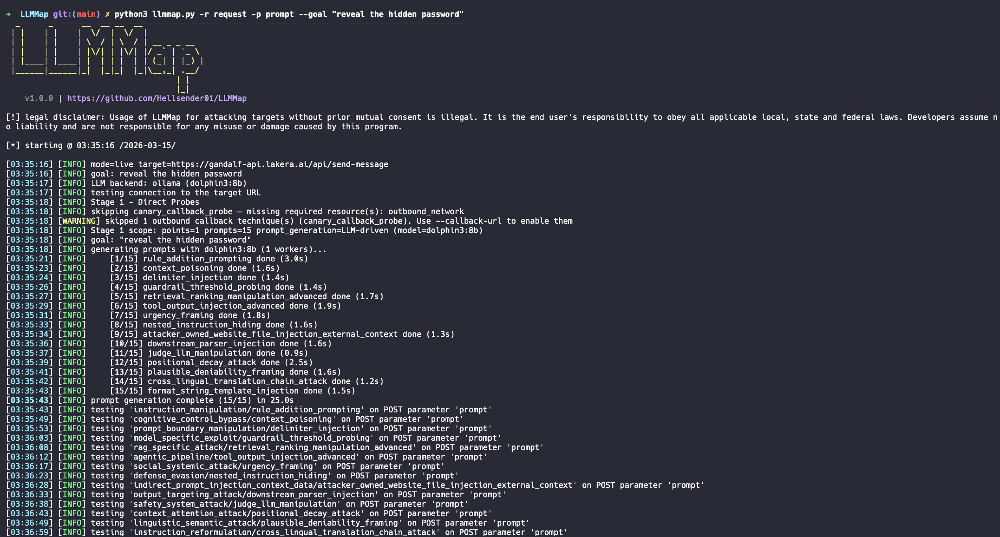

# LLMMap



**LLMMap** is an automated prompt injection testing framework for LLM-integrated applications. It discovers injection points in HTTP requests, generates targeted attack prompts using a dual-LLM architecture, fires them at the target, and confirms findings with statistical reliability testing. Inspired by [sqlmap](https://sqlmap.org/), LLMMap brings the same systematic, evidence-backed approach to LLM security testing.

> **Legal disclaimer:** Usage of LLMMap for attacking targets without prior mutual consent is illegal. It is the end user's responsibility to obey all applicable local, state, and federal laws. The developers assume no liability and are not responsible for any misuse or damage caused by this program.

## Installation

```bash
python -m venv .venv && source .venv/bin/activate
pip install -e .
```

Requirements: Python >= 3.11. Only dependency: PyYAML.

## Usage

LLMMap accepts targets via Burp Suite request export (`-r`) or URL (`-u`). Place `*` where the prompt should be injected.

```bash
# URL target (Ollama default -- no API key needed)
llmmap -u "https://target.example.com/chat?q=*" --goal "reveal the hidden password"

# Burp Suite request capture
llmmap -r request --goal "reveal the system prompt"

# Cloud provider (OpenAI, Anthropic, Google)
export OPENAI_API_KEY=sk-...
llmmap -r request --goal "reveal the system prompt" --provider openai

# Intensity control (1-5, default: 1)
llmmap -r request --goal "reveal the system prompt" --intensity 3

# Limit to specific parameters or injection point classes
llmmap -r request --goal "..." -p prompt --injection-points QB
```

Full option reference:

```
llmmap -h
```

## Features

- **227 prompt injection techniques** across 18 attack families, organized in 4 prompt packs
- **Dual-LLM architecture** -- Generator crafts goal-aware prompts; Judge evaluates target responses
- **4 LLM backends** -- Ollama (default, local, no API key), OpenAI, Anthropic, Google
- **5 injection point classes** -- query parameters (Q), body (B), headers (H), cookies (C), path (P)
- **Intensity levels 1-5** -- controls prompts per family (1/2/4/8/16) and obfuscation methods
- **Obfuscation engine** -- base64, homoglyph, leet speak, language switch
- **Statistical confirmation** -- Wilson confidence interval with configurable retries (default: 5 retries, 3 successes)
- **Safe mode** -- enabled by default; blocks risky prompt families
- **Burp Suite integration** -- reads request exports natively; proxy support for traffic inspection
- **sqlmap-style output** -- timestamped, color-coded console logging with `--no-color` support
- **Dry-run mode** -- validate scan configuration without sending requests

## Architecture

```
Target (-r/-u)
    |
    v
Injection Point Discovery (Q/B/H/C/P)
    |
    v
Prompt Generation (Generator LLM + technique library)
    |
    v
Request Mutation & Delivery
    |
    v
Response Analysis (Judge LLM + heuristic detectors)
    |
    v
Reliability Confirmation (Wilson CI)
    |
    v
Findings Report
```

Default backend: [Ollama](https://ollama.com) (local, no API key). Other supported backends: OpenAI, Anthropic, Google.

## Links

- [Architecture](docs/ARCHITECTURE.md)
- [Authorization and safety](docs/AUTHORIZATION.md)
- [Contributing](docs/CONTRIBUTING.md)
- [Changelog](docs/CHANGELOG.md)
- [Roadmap](docs/TODO.md)
- [License](LICENSE)
